# Personal Finance Management & Analytics System

A web-based Personal Finance Management and Analytics System developed using Java, JDBC, Servlets, JSP, Oracle SQL, Maven and Apache Tomcat.

## Technologies Used

- Java
- JDBC
- Servlets
- JSP
- HTML
- CSS
- JavaScript
- Oracle SQL
- Maven
- Apache Tomcat
- Git & GitHub

## Key Features

- User Registration and Login
- Session-based Authentication
- Dashboard with Financial Summary
- Add Income
- Add Expense
- Budget Management
- Savings Goal Management
- Goal Contribution
- Transaction Management
- Financial Analytics
- User Profile Management
- Logout and Session Security

## Project Structure

- Controller / Servlet Layer
- DAO Layer
- Service Layer
- Model Layer
- JSP / HTML / CSS / JavaScript Frontend
- Oracle Database

## Project Screenshots

### Login
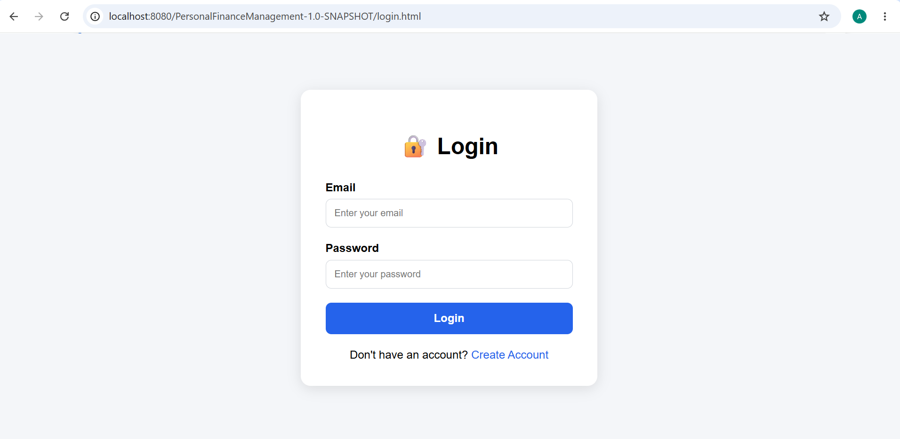

### Register
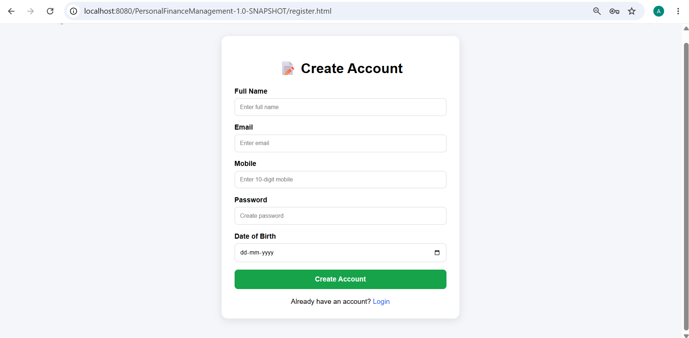

### Dashboard
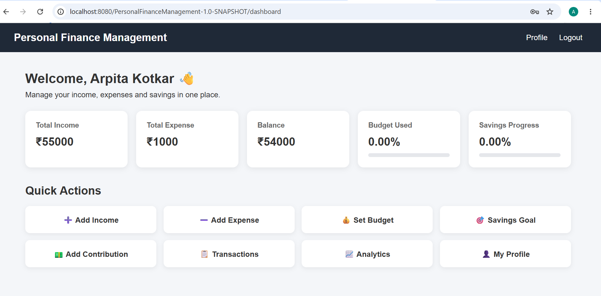

### Add Income
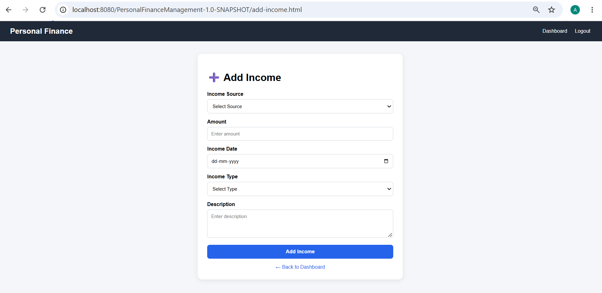

### Income Success
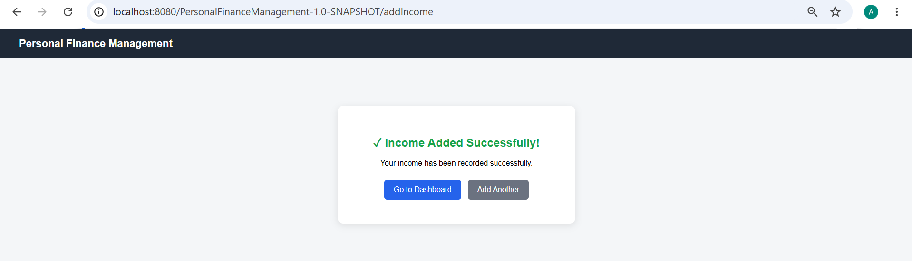

### Add Expense
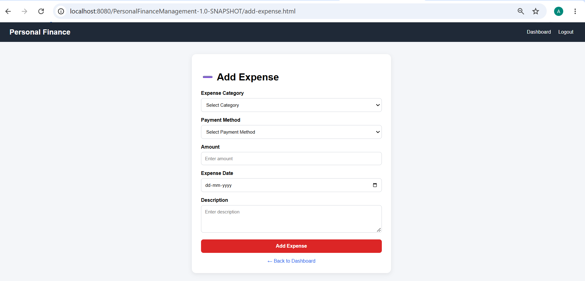

### Expense Success
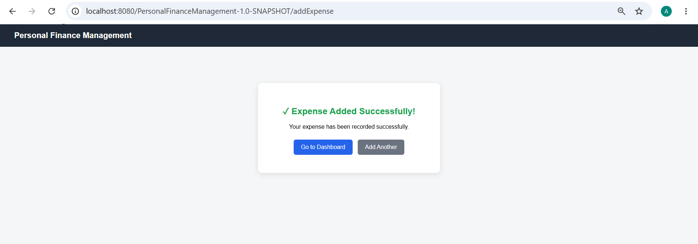

### Budget
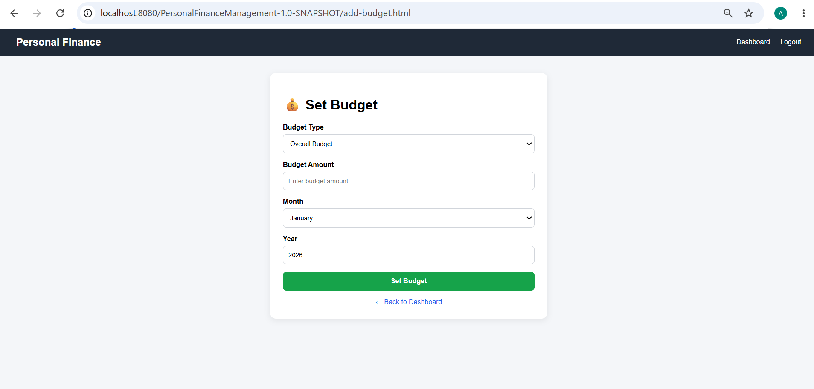

### Budget Success
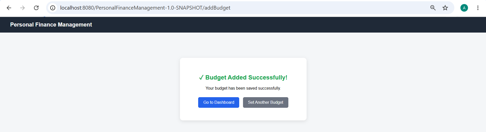

### Add Savings Goal
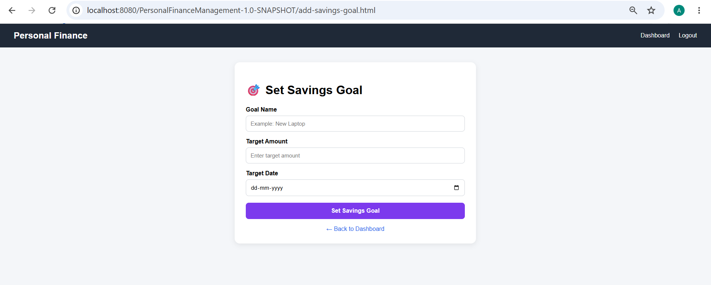

### Savings Goal Success
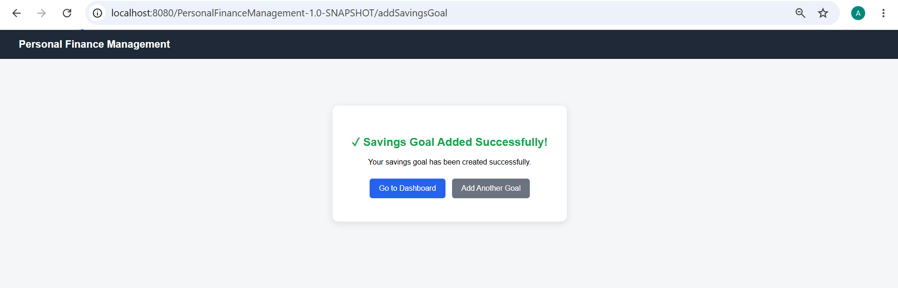

### Add Contribution
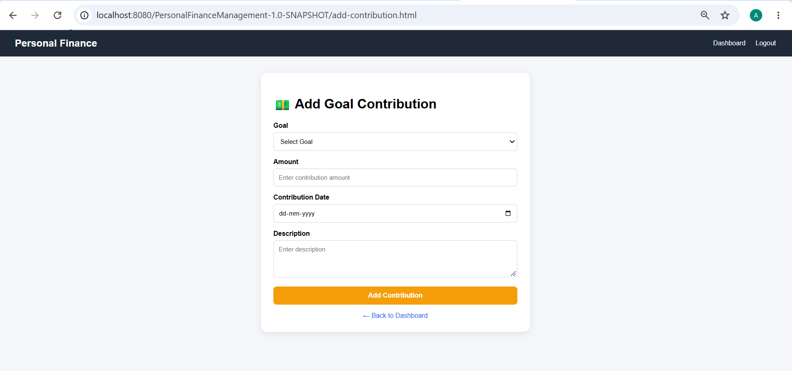

### Contribution Success
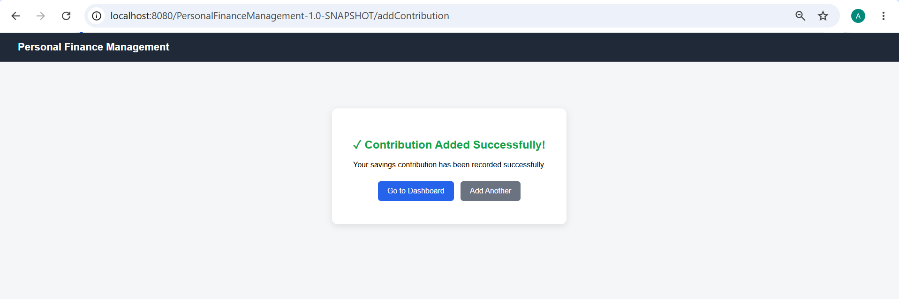

### Analytics

### Profile

### Logout

## Database

The project uses Oracle SQL for storing:

- User information
- Income records
- Expense records
- Budgets
- Savings goals
- Goal contributions
- Categories
- Payment methods

## Build & Run

1. Build the project using Maven.
2. Deploy the generated WAR file on Apache Tomcat.
3. Configure Oracle Database connection.
4. Start Apache Tomcat.
5. Open the application in a web browser.

## GitHub

This project is developed as a Java Developer portfolio project demonstrating Java web development, JDBC, database connectivity, MVC-style architecture, CRUD operations, authentication and financial analytics.
